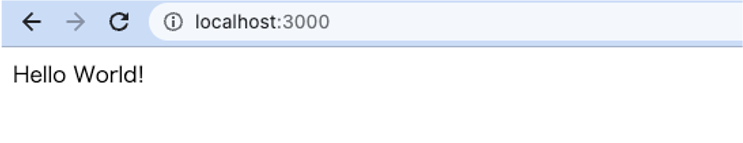
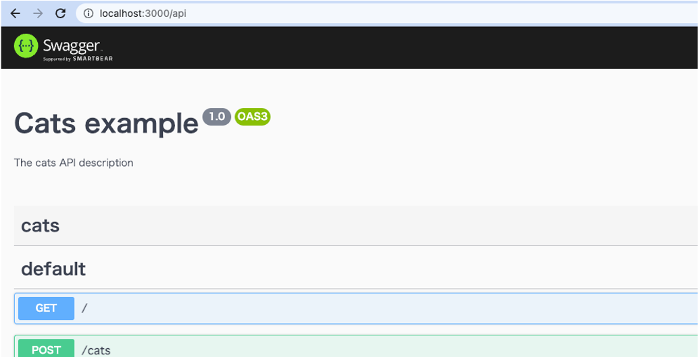

# 概要
データベースの接続情報を修正しよう

## 手順

### 1. Nodeモジュールをインストール
```console
$ npm install
```

### 2. アプリケーションを起動する
```console
$ npm run start:dev
```

このようなエラーが出るはずです。
```console
[Nest] 20333  - 2022/11/15 19:09:16   ERROR [TypeOrmModule] Unable to connect to the database. Retrying (1)...
Error: connect ECONNREFUSED 127.0.0.1:3306
    at TCPConnectWrap.afterConnect [as oncomplete] (node:net:1187:16)
```

mainのソースコードではmysqlに接続する設定になっています。
これをsqliteに変更しましょう

### 3. sqliteのパッケージをインストールする
```console
$ npm install sqlite3 --save
```

### 4. src/app.module.tsを修正する
```diff
@Module({
  imports: [TypeOrmModule.forRoot({
+   type: 'sqlite',
-   type: 'mysql',
-   host: 'localhost',
-   port: 3306,
-   username: 'root',
-   password: 'root8888',
    database: 'cat_cafe',
```

### 5. アプリケーション再起動
Ctrl + cで起動したアプリケーションを停止する。
```console
$ npm run start:dev
```

### 6. アクセスしよう
http://localhost:3000/


http://localhost:3000/api

