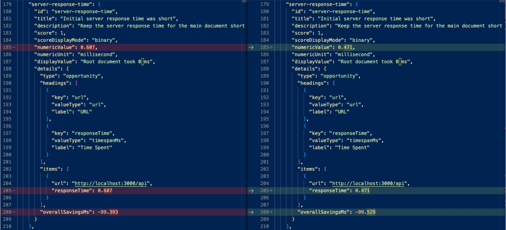

# 概要
HttpServerのモジュールを、[Express](https://expressjs.com/ja/)から[fastify](https://www.fastify.io/)に変更しよう。

[ベンチマークの結果](https://www.fastify.io/benchmarks/)

## 手順

### 1. パッケージをインストールする
```console
$ npm i --save @nestjs/platform-fastify @fastify/static
```

### 2. src/main.tsを修正する
```diff
+ import { FastifyAdapter, NestFastifyApplication } from '@nestjs/platform-fastify';
async function bootstrap() {
+ const app = await NestFactory.create<NestFastifyApplication>(AppModule, new FastifyAdapter());
- const app = await NestFactory.create(AppModule);
```

### 3. 動作するか試してみましょう
http://localhost:3000/api

## パフォーマンスは上がったのか？　=>　多少
正直ルーティング部分がちょっと速くなる程度なので効果の程は...
でもまあ早い。

左 express、右 fastify

Google chromeのDevtoolのLighthouseで録りました。