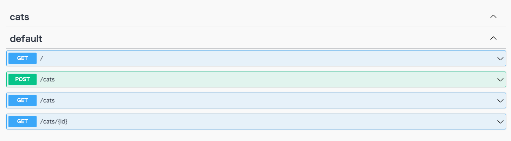
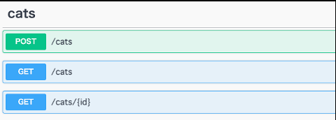

# 概要
NestJSはコードの中にAPI設計を書くことができます。
API設計をコードの中にかけることは、別のドキュメントでAPI設計を管理するより管理が楽です。



cats APIがcatsのタブの下ではなく、defaultの下にあるので、移動しましょう。

## 手順

### 1. src/cats/cats.controller.tsを修正する
```diff
+ import { ApiTags, ApiCreatedResponse, ApiInternalServerErrorResponse, ApiOkResponse } from '@nestjs/swagger';
- import { ApiCreatedResponse, ApiInternalServerErrorResponse, ApiOkResponse } from '@nestjs/swagger';

+ @ApiTags('cats')
@Controller('cats')
```

### 2. 確認してみましょう
http://localhost:3000/api

